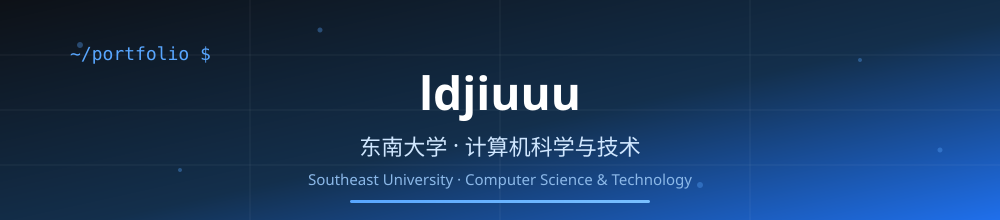

<!--
============================================================
  个人 GitHub 主页 README（求职向 · 中英双语）
  使用说明：
  1. 在 GitHub 新建一个与你的用户名同名的仓库（例如 xxx/xxx）
  2. 把本文件夹内容复制进去
  3. 用户名已填好（ldjiuuu），只需替换姓名、邮箱、项目等占位内容
  4. 推送后主页立即生效，详细步骤见 PUBLISH_GUIDE.md
============================================================
-->

  <!-- 顶部横幅（可选）：想换图时直接替换 assets/banner.svg，或删掉这一行 -->
  

  <!-- 打字动画：在 lines= 后面追加或修改展示的文字（中文需 URL 编码） -->
  

   

  <!-- 徽章：学校 / 专业 / 求职目标 -->
  
  
  
   
  

---

## 👋 你好，我是你的名字

> 🎓 东南大学 · 计算机科学与技术 在读 | 💼 求职方向：后端开发 / 软件工程

用两三句话给面试官留下第一印象，例如：

- 🔭 目前专注于 **后端开发**，正在系统学习 Java / Spring / 数据库 / 操作系统
- 🌱 坚持在 GitHub 记录学习过程和项目，保持每周有真实提交
- 📌 相信"能讲清楚才是真掌握"，正在用博客 + 项目沉淀知识
- 📫 联系我：`your-email@example.com`

---

## 🛠️ 技术栈

  <!-- 增删技术：修改 icons= 后面的参数即可，支持列表见 https://skillicons.dev -->
  

| 分类 | 技术 |
| --- | --- |
| 编程语言 | Python / Java / C++ / JavaScript / TypeScript |
| 前端 | HTML / CSS / Vue / React |
| 后端 | Node.js / Spring Boot |
| 数据库 | MySQL / Redis |
| 工具链 | Git / Docker / Linux |

---

## 🚀 精选项目

这里放你 **最能打** 的 2-3 个项目（课程设计、竞赛、开源贡献都行），每个项目用一句话讲清"做了什么 + 技术栈 + 亮点"。

| 项目 | 简介 | 技术栈 | 链接 |
| --- | --- | --- | --- |
| 🏗️ 项目一 | TODO：一句话说明项目解决了什么问题 | Java / Spring Boot | [仓库链接](https://github.com/ldjiuuu) |
| 📊 项目二 | TODO：说明你的角色与亮点 | Vue / Python | [仓库链接](https://github.com/ldjiuuu) |
| 📝 开源贡献 | TODO：说明参与的开源项目 | 按实际填写 | [PR 链接](https://github.com/ldjiuuu) |

> 💡 面试官最关心 **你的思考过程** 和 **你解决过的问题**，每个项目用两三句话讲清楚就够了。

---

## 📊 GitHub 数据

  
  
   
  

---

## 🐍 贡献小蛇

  <picture>
    <source media="(prefers-color-scheme: dark)" srcset="https://raw.githubusercontent.com/ldjiuuu/ldjiuuu/output/github-contribution-grid-snake-dark.svg" />
    <source media="(prefers-color-scheme: light)" srcset="https://raw.githubusercontent.com/ldjiuuu/ldjiuuu/output/github-contribution-grid-snake.svg" />
    
  </picture>

> ⚙️ 小蛇由 `.github/workflows/snake.yml` 每天自动生成：推送该文件后，在仓库 Actions 页面手动运行一次 `generate-snake` 即可生效（详见 PUBLISH_GUIDE.md）。

---

## 📚 学习路线

我的 GitHub 学习路线与求职准备计划见 **[LEARNING_ROADMAP.md](LEARNING_ROADMAP.md)**，欢迎交流。

正在学习 / 近期计划：

- [x] Git 与 GitHub 基础操作
- [ ] GitHub Actions 自动化（持续集成）
- [ ] GitHub Pages 个人网站 / 简历页
- [ ] 参与一个开源项目（修文档 → 修 Bug → 提功能）

---

## 📫 联系我

  
  
  
  

---

  由 Codex 协助设计 · 欢迎 Fork 后改成你自己的主页

